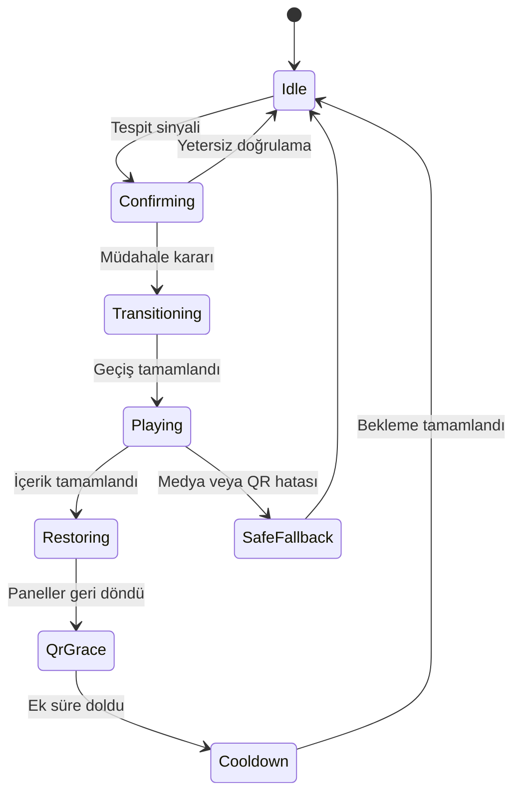

# Modüler mimari

| Modül | Sorumluluk |
| --- | --- |
| `apps.display` | Büyük ekran, durum makinesi, geçiş ve adaptör arayüzleri |
| `apps.content` | Sürümlü içerik kataloğu ve yaş bandı geri dönüş politikası |
| `apps.qr` | Olay bağlamı, opak token ve QR yaşam döngüsü |
| `apps.support` | Mobil öncelikli destek deneyimi |
| `apps.yedam` | Doğrulanmış merkez kataloğu ve güvenli harita hedefleri |
| `apps.surveys` | Sürümlü soru kodları, dallanma ve anonim mikro anket |

Gerçek model çıktısı önce normalleştirilir. Karar motoru yalnızca kararlı bir sinyali müdahaleye dönüştürür. İçerik seçici onaylı/aktif katalogdan paket seçer. Ekran orkestratörü oynatma ve QR yaşam döngüsünü yönetir. Model kodu hiçbir zaman doğrudan şablona veya ankete bağlanmaz.

Desteklenen ön yüz adaptör örnekleri `demo-video`, `websocket`, `http-inference`, `manual` ve `model-fusion` dosyalarında bulunur. Yerel Python köprüsü aynı `normalized-detection` sözleşmesini HTTP veya WebSocket üzerinden yayımlamalıdır.
